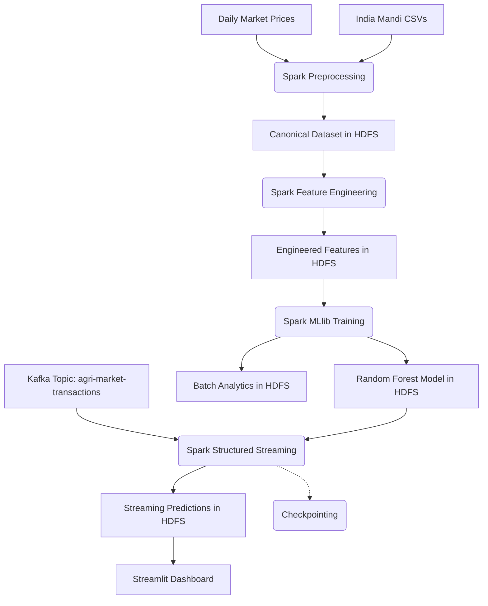

# Agricultural Big Data Analytics: End-to-End Market Anomaly Detection

This repository contains the complete implementation of a real-time agricultural market anomaly detection system, built entirely from scratch. The system ingests, normalizes, engineers features, predicts anomalies using machine learning, and visualizes results in a real-time streaming dashboard.

## 🏗️ Complete Architecture



## 📊 Final ML Results

Model Selection was performed using a deterministic 1% entity-safe sample and an untouched 2025+ temporal test set.

**Model Details:**
- Model: Random Forest Classifier
- Number of Trees: 100
- Max Depth: 12
- Max Bins: 128
- Instance Weighting (for Class Imbalance): 1.2

**Test Results (2025+ Unseen Data):**
- Accuracy: 85.06%
- False Positive Rate (FPR): 1.41%

**Confusion Matrix:**
- True Negatives (TN): 43,497
- False Positives (FP): 621
- False Negatives (FN): 7,194
- True Positives (TP): 991

## 📂 HDFS Artifact Paths

All data is reliably persisted in HDFS with Replication Factor = 3:
- **Canonical Dataset:** `/agri/processed/canonical`
- **Engineered Features:** `/agri/features/engineered`
- **Trained Model:** `/agri/models/anomaly_prediction_rf`
- **Batch Predictions:** `/agri/analytics/anomaly_predictions`
- **Streaming Predictions Sink:** `/agri/streaming/anomaly_predictions`
- **Streaming Checkpoints:** `/agri/checkpoints/anomaly_stream`

## 🚀 Real-Time Streaming Infrastructure (Kafka)

Kafka natively operates on the host but uses a robust multi-listener setup for seamless Docker cross-communication.
- **Topic:** `agri-market-transactions`
- **Host Producer (Native Mac):** `localhost:9092`
- **Docker Consumer (Spark Container):** `host.docker.internal:29092`

## 📈 Dashboard Configuration

A lightweight, real-time PySpark + Streamlit dashboard reads directly from the streaming sink.
- **Path:** `src/dashboard/app.py`
- **Port:** `8501`
- **Startup Command (Using Docker):**
  ```bash
  docker build -f Dockerfile.dashboard -t agri-dashboard .
  docker run -d --name agri-dashboard --network docker_default -p 8501:8501 agri-dashboard
  ```
- **Features:** 
  - Real-time KPI Cards (Total Predictions, Anomalies, %).
  - Dynamic Filters (State, District, Commodity, Market).
  - Visualization (Anomaly Probabilities, Top Markets, Top Commodities).
  - Auto-refresh mechanism (Polling HDFS safely via `streamlit-autorefresh` every 5 seconds).
